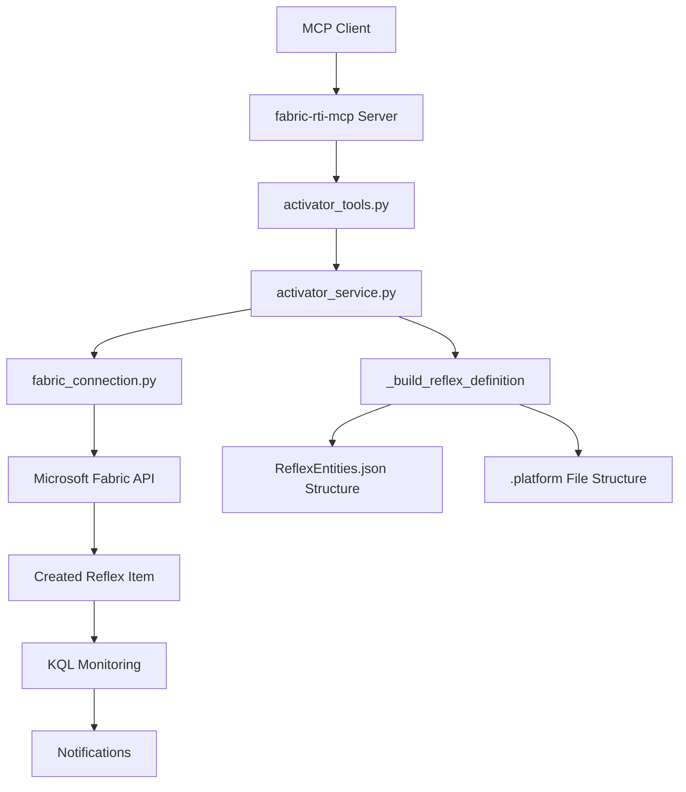
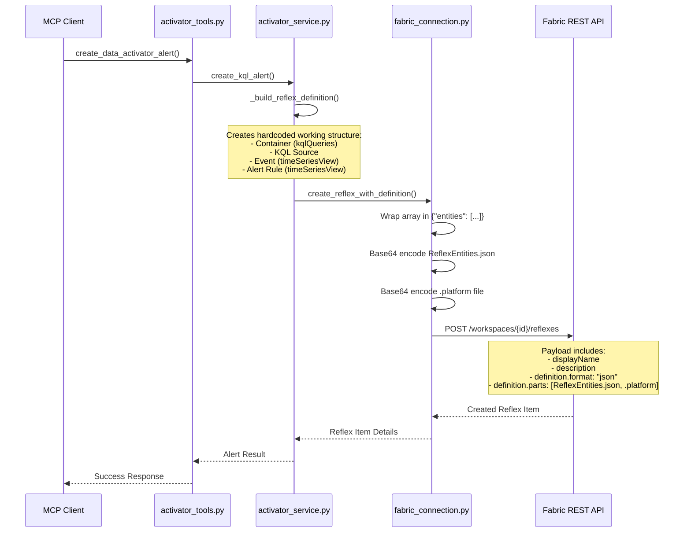

# Data Activator Implementation Guide

## Overview

This document explains the Microsoft Fabric Data Activator (Reflex) implementation in the fabric-rti-mcp project. The Data Activator allows creating KQL-based alerts that monitor data sources and send notifications when specific conditions are met.

## Architecture Overview



## Data Flow Diagram



## Key Components

### 1. activator_tools.py
- **Role**: MCP tool interface
- **Function**: `create_data_activator_alert()`
- **Purpose**: Validates input parameters and calls the service layer

### 2. activator_service.py
- **Role**: Business logic layer
- **Key Method**: `create_kql_alert()`
- **Purpose**: Orchestrates the alert creation process
- **Recent Changes**: Now uses hardcoded working examples instead of dynamic generation

### 3. fabric_connection.py
- **Role**: API communication layer
- **Key Method**: `create_reflex_with_definition()`
- **Purpose**: Handles HTTP requests to Fabric REST API
- **Recent Changes**: Fixed ReflexEntities.json wrapping and encoding

## Data Structures

### ReflexEntities.json Structure
The core definition file contains an array of entities wrapped in an "entities" object:

```json
{
  "entities": [
    {
      "uniqueIdentifier": "6a3d39a9-db4d-4e64-a624-ed3b701480ba",
      "payload": {
        "name": "eventhouseravit_queryset",
        "type": "kqlQueries"
      },
      "type": "container-v1"
    },
    {
      "uniqueIdentifier": "fd9cd4f0-adb5-418a-835c-4b1f8a03c761",
      "payload": {
        "name": "eventhouseravit event",
        "runSettings": {
          "executionIntervalInSeconds": 3600
        },
        "query": {
          "queryString": "print 1"
        },
        "eventhouseItem": {
          "itemId": "a490bc60-0ddd-ab7c-4ee0-541e423f6973",
          "workspaceId": "00000000-0000-0000-0000-000000000000",
          "itemType": "KustoDatabase"
        },
        "queryParameters": [],
        "metadata": {
          "workspaceId": "724adb3c-4be2-4655-b9bd-dd6c189a4696",
          "measureName": "",
          "querySetId": "bd354482-5fc8-4076-b0d0-d0e05c663c9d",
          "queryId": "81d4e8c8-4985-45a5-9b77-d27a8299e405"
        },
        "parentContainer": {
          "targetUniqueIdentifier": "6a3d39a9-db4d-4e64-a624-ed3b701480ba"
        }
      },
      "type": "kqlSource-v1"
    },
    {
      "uniqueIdentifier": "86ccd2a6-571f-4bab-a66f-131c247f3be9",
      "payload": {
        "name": "eventhouseravit event",
        "parentContainer": {
          "targetUniqueIdentifier": "6a3d39a9-db4d-4e64-a624-ed3b701480ba"
        },
        "definition": {
          "type": "Event",
          "instance": "{...complex JSON template...}"
        }
      },
      "type": "timeSeriesView-v1"
    },
    {
      "uniqueIdentifier": "3d481f12-aa86-4fec-96f3-28fa7b05d005",
      "payload": {
        "name": "eventhouseravit alert",
        "parentContainer": {
          "targetUniqueIdentifier": "6a3d39a9-db4d-4e64-a624-ed3b701480ba"
        },
        "definition": {
          "type": "Rule",
          "instance": "{...complex JSON template...}",
          "settings": {
            "shouldRun": false,
            "shouldApplyRuleOnUpdate": false
          }
        }
      },
      "type": "timeSeriesView-v1"
    }
  ]
}
```

### .platform File Structure
```json
{
  "$schema": "https://developer.microsoft.com/json-schemas/fabric/gitIntegration/platformProperties/2.0.0/schema.json",
  "metadata": {
    "type": "Reflex",
    "displayName": "My activatorTest",
    "description": "m ativator test"
  },
  "config": {
    "version": "2.0",
    "logicalId": "4042fb10-1349-b4c0-4361-514b6b19c1fe"
  }
}
```

## Recent Changes and Fixes

### Problem History
1. **Initial Issue**: Getting 400 Bad Request with "InvalidDefinitionFormat" error
2. **Root Cause**: The API expected a specific structure that wasn't documented clearly
3. **Solution**: Used working examples from successful Reflex creations

### Key Fixes Applied

#### 1. Entity Structure Correction
- **Before**: Generated dynamic structure that didn't match API expectations
- **After**: Using hardcoded working examples that include all required entity types:
  - `container-v1`: KQL Queries container
  - `kqlSource-v1`: The actual KQL query definition
  - `timeSeriesView-v1` (Event): Event definition for the data source
  - `timeSeriesView-v1` (Rule): Alert rule with notification settings

#### 2. ReflexEntities.json Wrapping
- **Problem**: API expected `{"entities": [...]}` but we were sending raw array
- **Fix**: Wrapped the entity array in an entities object before base64 encoding

#### 3. Correct Data Source Configuration
- **Before**: Using placeholder/incorrect cluster and database information
- **After**: Using real eventhouse configuration:
  - Cluster: `trd-g5bqmk5yh7guhpjwmz.z9.kusto.fabric.microsoft.com`
  - Database: `eventhouseravit`
  - Item ID: `423f6973-541e-4ee0-ab7c-0ddda490bc60`

#### 4. Debug Infrastructure
- Added comprehensive logging to trace:
  - ReflexEntities.json structure before encoding
  - .platform file structure before encoding
  - Full HTTP request/response details
  - Base64 encoded payloads

## Current Status

### What Works
- ✅ Empty Reflex creation (without definition)
- ✅ Proper API authentication and endpoint access
- ✅ Hardcoded structure generation matching working examples

### What's Being Debugged
- ❓ Complete Reflex creation with full definition
- ❓ The "entities" wrapping is implemented but still getting 400 errors

### Current Investigation
The implementation now uses exact working examples, but still receives `InvalidDefinitionFormat` errors. This suggests either:
1. A subtle encoding/formatting issue
2. Missing required fields not visible in the examples
3. API version or endpoint differences
4. Authentication scope limitations

## Testing Commands

```bash
# Start the MCP server
python -m fabric_rti_mcp.server

# Test Data Activator creation
mcp_fabric-rti-mc_create_data_activator_alert \
  --alert_name "Test Alert" \
  --cluster_uri "https://trd-g5bqmk5yh7guhpjwmz.z9.kusto.fabric.microsoft.com" \
  --kql_query "fdg | take 10" \
  --notification_recipients '["test@example.com"]' \
  --workspace_id "724adb3c-4be2-4655-b9bd-dd6c189a4696"
```

## Debug Output Locations

When testing, look for debug output in VS Code's stderr logs:
- `=== HARDCODED REFLEX DEFINITION STRUCTURE ===`
- `=== WRAPPED ENTITIES STRUCTURE ===`
- `=== .PLATFORM FILE STRUCTURE ===`
- `=== FABRIC API REQUEST TRACE ===`

This output shows exactly what structures are being created and sent to the API.

## Next Steps for Investigation

1. **Compare Encoded Payloads**: Decode the base64 payloads we're sending vs. known working examples
2. **Test Minimal Structure**: Try creating with just container + kqlSource (without timeSeriesView entities)
3. **API Documentation Review**: Check for any undocumented requirements or field restrictions
4. **Scope Verification**: Ensure the authentication token has all required permissions for Reflex creation with definitions

## File Locations

- **Main Implementation**: `fabric_rti_mcp/activator/`
- **Tool Interface**: `activator_tools.py`
- **Business Logic**: `activator_service.py`
- **API Client**: `fabric_connection.py`
- **Server Registration**: `fabric_rti_mcp/server.py`
